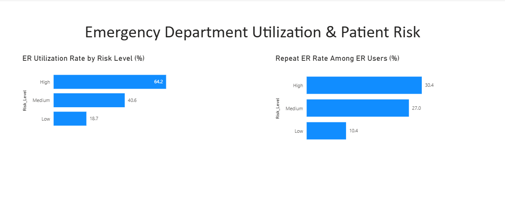

# Population Health Analytics

## Project Overview

This project analyzes a simulated population of 1,000 patients to identify healthcare utilization patterns, patient risk factors, and opportunities to support improved population health outcomes.

The project follows an end-to-end healthcare analytics workflow using Excel for initial data review, SQL Server for data validation and analysis, and Power BI for visualization and reporting.

## Business Question

How can patient and healthcare utilization data be used to identify patterns, high-utilization populations, and potential opportunities to improve patient outcomes?

## Tools Used

- Excel
- SQL Server
- Power BI
- Healthcare / EHR Data Analysis

---

# Part 1: Emergency Department Utilization & Patient Risk

### Business Question

What patterns exist in Emergency Department utilization, and is patient risk level associated with ER use and repeat ER utilization?

### Analysis Approach

Patient and encounter data were analyzed in SQL Server to evaluate:

- Emergency Department utilization
- Unique ER patients
- Repeat ER utilization
- Patient risk levels
- ER utilization rates within each risk group
- Repeat ER rates among ER users

Rather than relying only on raw encounter counts, utilization rates were calculated using the appropriate patient populations as denominators.

### Key Findings

- **High-risk patients:** 64.2% had at least one ER visit.
- **Medium-risk patients:** 40.6% had at least one ER visit.
- **Low-risk patients:** 18.7% had at least one ER visit.

Among patients who used the ER:

- **High-risk:** 30.4% were repeat ER users.
- **Medium-risk:** 27.0% were repeat ER users.
- **Low-risk:** 10.4% were repeat ER users.

A total of **100 patients had two or more ER visits**:
- 64 Medium-risk patients
- 31 High-risk patients
- 5 Low-risk patients

 ### Emergency Department Utilization & Patient Risk

### Analytical Insight

The analysis suggests an association between patient risk level and ER utilization. High-risk patients had both the highest overall ER utilization rate and the highest repeat ER utilization rate.

An important analytical lesson from this stage was that raw counts alone can be misleading when population sizes differ. Comparing utilization rates provided a more meaningful view of ER use across patient risk groups.

These findings identify patterns for further investigation but do not establish that risk level causes ER utilization.

### Next Phase

The next phase will investigate potential drivers of ER utilization, including preventive care patterns, healthcare access, clinical factors, and social determinants of health (SDOH).

---

## Project Status

**Part 1:** Emergency Department Utilization & Patient Risk — Complete  
**Part 2:** Preventive Care & Healthcare Access — In Progress  
**Part 3:** Clinical & SDOH Analysis — Planned  
**Final Phase:** Population Health Power BI Dashboard — Planned
